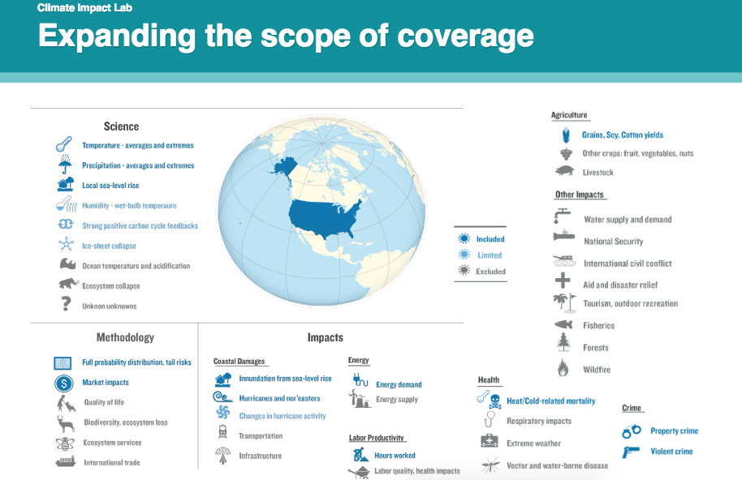

.. gcp

Global Climate Prospectus
=========================

The GCP takes most of the methodology from the American Climate Prospectus 
and expands the geographical scope as well as sectoral focus. 

Our climate data, however, is different including only the 21 models that are downscaled in the NASA BCSD data. Also, impact functions are computed for every climate model under each of the RCP scenarios. 

* `Impact Lab Team <http://www.impactlab.org/#who-we-are>`_

* `Rhodium Group <http://www.rhg.com>`_

* `Global Policy Lab <http://globalpolicy.science/>`_ at Berkeley

* `Energy Policy Institute <https://epic.uchicago.edu/>`_ at UChicago

* `Rutgers Energy Institute <http://rei.rutgers.edu/>`_ 

 